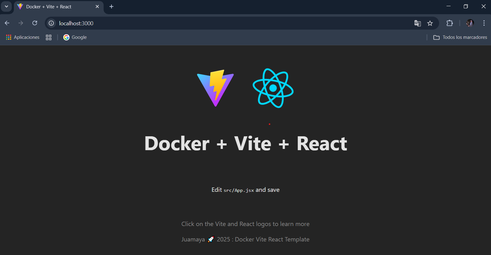

# Docker + React 

## Crear Proyecto con Vite

```bash
npm create vite@latest
```
First, run the development server:

```bash
npm run dev
# or
yarn dev
# or
pnpm dev
# or
bun dev
```

# 🐳
# <font color="#00ff00" > Crear un Contenedor para el Proyecto</font>



## Getting Started


## Crear archivo: Dockerfile en la raiz de tu proyecto

>Dockerfile

```js
FROM node:alpine

WORKDIR /app

COPY package*.json ./

RUN npm install

COPY . ./

RUN npm run build

EXPOSE 3000

CMD ["npm", "start"]

```

## Crear archivo: packaage.json

```json
{
  "name": "docker-react-vite",
  "private": true,
  "version": "0.0.0",
  "type": "module",
  "scripts": {
    "dev": "vite",
    "build": "vite build",
    "lint": "eslint .",
    "preview": "vite preview",
    "start": "vite preview --host"
  },
  "dependencies": {
    "react": "^19.1.0",
    "react-dom": "^19.1.0"
  },
  "devDependencies": {
    "@eslint/js": "^9.30.1",
    "@types/react": "^19.1.8",
    "@types/react-dom": "^19.1.6",
    "@vitejs/plugin-react": "^4.6.0",
    "eslint": "^9.30.1",
    "eslint-plugin-react-hooks": "^5.2.0",
    "eslint-plugin-react-refresh": "^0.4.20",
    "globals": "^16.3.0",
    "vite": "^7.0.4"
  }
}
```

## Crear archivo: .dockerignore

```bash
node_modules

```

## <font color="#6bbfe5ff">Abre Terminal en VScode.</font>

## <font color="#00ff00">Ejecuta estos comandos dentro de la carpeta del proyecto</font>


## Crear imagen
>docker-react

```bash
wsl docker build -t docker-react .
```
## Crear y correr contenedor
>react-container

```bash
wsl docker run -d --name react-container -p 3000:4173 docker-react
```

## Ver imagenes
```bash
wsl docker images
```
## Ver contenedor
```bash
 wsl docker ps -a
```

## Start contenedor
```bash
 wsl docker start react-container
```

## Stop contenedor
```bash
wsl docker stop react-container
```
## Eliminar contenedor
```bash
wsl docker rm react-container
```

## Stop contenedor  y  Eliminar contenedor
```bash
 wsl docker stop next-container &&  wsl docker rm next-container
```

## Para crear y levantar el contenedor:

<font color="#00ff00" >En la terminal, desde la carpeta del proyecto, ejecuta:</font>

```bash
  wsl docker run -d --name next-container -p 3000:3000 docker-next
```

###  Luego abre tu navegador y visita: http://localhost:3000


---

# 🐧 Instalar Docker en Windows sin Docker Desktop, usando WSL2 y Ubuntu

## ✅ Requisitos previos

Windows 10/11 actualizado

WSL2 activado

Ubuntu instalado desde Microsoft Store

¿Ya tienes WSL2 y Ubuntu instalado? Si no, te lo explico abajo. Si sí, pasa a la instalación de Docker.

## 🔧 PASO 1: Instalar WSL2 y Ubuntu

1.1 Instala WSL con Ubuntu desde CMD o PowerShell:

```bash
wsl --install -d Ubuntu
```

Esto instala Ubuntu y configura WSL2 automáticamente. Luego reinicia tu PC si se te solicita.

## 🐳 PASO 2: Instalar Docker en Ubuntu (WSL2)

# <font color="#ff0000">Abre Ubuntu desde el menú Inicio.</font>


## <font color="#ff0000">Ejecuta estos comandos dentro de Ubuntu:</font>

```bash
# Actualizar el sistema
sudo apt update && sudo apt upgrade -y


# Instalar Docker

sudo apt install docker.io -y


# Habilitar el servicio de Docker
sudo service docker start

# Añadir tu usuario al grupo docker (para evitar usar sudo cada vez)

sudo usermod -aG docker $USER
```

Sal del terminal con<font color="#ff0000"> **exit**, cierra Ubuntu y vuelve a abrirlo </font>para aplicar los cambios de grupo.

## ✅ Verifica que Docker funciona


## <font color="#ff0000">Dentro de Ubuntu:</font>


```bash
docker --version
docker run hello-world
```

Si ves un mensaje de bienvenida, Docker está funcionando sin Docker Desktop
 # 🎉

---

## 🧠 Opcional: Ejecutar Docker automáticamente al abrir Ubuntu

Cada vez que abras Ubuntu, ejecuta:

```bash
sudo service docker start
```

Para automatizarlo:

```bash
echo "sudo service docker start" >> ~/.bashrc
```

Para ver si esta corriendo docker:

```bash
sudo service docker status
```

---

## 🎁 Beneficios

:::tip

Mucho menos uso de CPU y RAM.

Cero uso de Docker Desktop.

Mejor integración con Linux-based dev tools.

:::  
