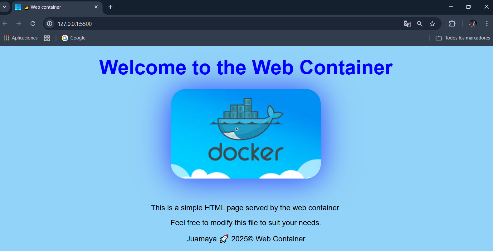

# Docker + httpd

# 🐳 Docker Container




# <font color="#00ff00" > Crear un Contenedor para el Proyecto</font>
## <font color="#00ff00" >  En Windows Docker Desktop de estar corriendo </font>

## CREAR index.html

> docker-html/index.html

---

```html
<!DOCTYPE html>
<html lang="en">
  <head>
    <meta charset="UTF-8" />
    <meta name="viewport" content="width=device-width, initial-scale=1.0" />
    <title>👉Web container</title>
    <link rel="shortcut icon" href="img/bart.ico" type="image/x-icon" />
    <link rel="stylesheet" href="styles.css" />
  </head>

  <body>
    <h1>Welcome to the Web Container</h1>
    
    <p>This is a simple HTML page served by the web container.</p>
    <p>Feel free to modify this file to suit your needs.</p>
    <script>
      console.log("Web container is running!");
    </script>
    <footer>
      <p>Juamaya 🚀 2025&copy; Web Container</p>
    </footer>
  </body>
</html>
```

## CREAR styles.css

> dockerhtml/styles.css

```css
* {
  margin: 0;
  padding: 0;
  box-sizing: border-box;
}
body {
  font-family: Arial, sans-serif;
  background-color: #92d3f9;
  color: black;
}
h1 {
  text-align: center;
  margin: 2rem;
  margin-bottom: 2rem;
  color: #00f;
  font-size: 4rem;
}

.container-image {
  display: block;
  margin: 0 auto;
  width: 30%;
  height: auto;
  border-radius: 3rem;
  box-shadow: 0 4px 100px rgba(0, 0, 255, 0.7);
  transition: transform 0.2s;
  margin-bottom: 5rem;
}
p {
  text-align: center;
  font-size: 1.5rem;
  margin: 20px 0;
}
```

# ✅ Usando un archivo Dockerfile 

## CREAR Dockerfile en la carpeta raiz del proyecto

>Dockerfile

```bash
FROM httpd:alpine

COPY . /user/local/apache2/htdocs/
```
## <font color="#6bbfe5ff">Abre Terminal en VScode.</font>

## <font color="#00ff00">Ejecuta estos comandos dentro de la carpeta del proyecto</font>

## CREAR IMAGEN
>mi_web

```bash
docker build --tag mi_web .
```

## CREAR y LEVANTAR CONTENEDOR
>web-httpd

```bash
 docker run -d -p 8090:80 --name web-httpd  mi_web
```
###  Luego abre tu navegador y visita: http://localhost:8090


# ✅ Usando un archivo docker-compose.yml

>docker-compose.yml


```yml
version: '3.8'

services:
  web:
    image: httpd:alpine
    container_name: mi_pagina_html
    ports:
      - "8080:80"
    volumes:
      - ./html:/usr/local/apache2/htdocs/

```

## Estructura esperada:
<font color="#00ff00" > Debes tener el siguiente contenido en tu proyecto:</font>
 

```css
tu-proyecto/
│
├── docker-compose.yml
└── html/
    └── index.html
```
## Para levantar el contenedor:
<font color="#00ff00" >En la terminal, desde la carpeta donde está el docker-compose.yml, ejecuta:</font>

```bash
docker-compose up -d
```

###  Luego abre tu navegador y visita: http://localhost:8080